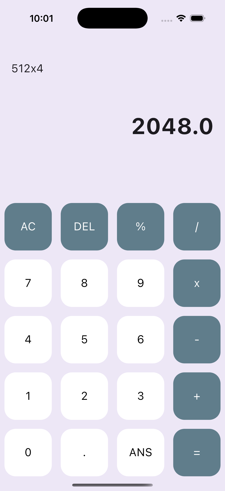

# Calculator App (Flutter)

A clean, functional calculator that can handle complex mathematical expressions. This project focuses on **Advanced Layouts** using grids and simplifying complex logic with helper packages.

  

## 🎯 Learning Outcomes
By building this project, you will learn:
- **GridView.builder:** How to efficiently render a grid of buttons without writing repetitive code.
- **Algorithms:** Writing helper functions to determine if a button is a number or an operator.
- **External Packages:** Using `math_expressions` to parse strings (e.g., "2 + 2") into actual numeric values.
- **String Manipulation:** Handling backspace functionality and clearing inputs.

## 📱 Features
- **Standard Math:** Addition, Subtraction, Multiplication, Division.
- **Editing Tools:** "AC" (All Clear) and "DEL" (Delete last character).
- **Smart Coloring:** Operators are colored differently from numbers automatically based on logic.
- **Responsive Grid:** Buttons resize dynamically to fit the screen.

## 🚀 How to Run

1. **Ensure you are in the project directory:**
    
    `cd simple_calculator`
    
2. **Install Dependencies:**
    
    `flutter pub get`
    
3. **Run the App:**
    
    `flutter run`

## 🔙 Back to Main Repo

Find more projects and the full learning roadmap here:
[Flutter Example Apps](https://github.com/thaisangdang/flutter_example_apps)

## 📘 Want to Build Bigger Apps?

This project is just the beginning. If you want to learn how to architect production-ready applications with scalable code, check out my premium guide:

👉 [**Master Flutter Architecture - Build a Production-Ready Social App from Scratch**](https://thaisang.gumroad.com/l/flutter-architecture-build-a-social-app)

## ☕ Support My Work

If you found this project helpful, consider [buying me a coffee](https://buymeacoffee.com/thaisangdang) to keep my work coming!